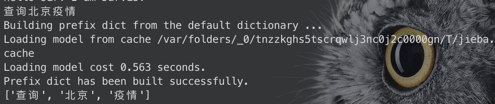

# 大作业实验报告

## 小组成员

组长：吴骏PB20050999

组员：张如凡PB20051054 汤忠翰PB20050998

## 内容简介

J.A.R.V.I.S.，Just a Rather Very Intelligent System，是出现在电影里的一个人工智能，它能够分析使用者的命令并对其进行一系列的处理。抱着对人工智能，网络通信等方面的好奇心，我们决定实现一个类似于上述功能的个人助理。在打开个人助理的服务器的情况下，每个使用它的用户只需要通过一个客户端连接服务器即可使用全部功能。利用websocket连接方式实现服务器与客户端的通讯，通过高效的异步io的方式（即asyncio）来实现客户端于服务器之间的高效信息传递处理，利用中文分词的方式处理用户的输入输出，利用网络爬虫的相关技术实现用户的请求，同时还利用了深度学习的技术自动生成对话聊天，支持不同客户端用户之间的留言，同时还完成了该项目的gui的制作，将其打造为一个可以在日常生活中方便使用并进行智能化操作的个人助理。

## 各功能的具体实现方法介绍

### 总体工程架构

负责分工：吴骏


### 客户端与服务器的通信处理

负责分工：吴骏

#### 消息格式

客户端与服务器之间采用websocket连接进行通信，消息传递采用 `json` 格式，相关消息格式由我们自己规定，细节可在文件夹doc/datatype.md下查看。这里放出几个例子：

```json
{
    "type": "login",
    "content": {
        "name": "",
        "password": ""
    }
}
{
    "type": "cmd",
    "content": {
        "cmd_type": "send_msg",
        "text": "",
        "target_name": ""
    }
}
{
    "type": "logout",
    "content": {
        "name": ""
    }
}
{
    "type": "cmd_recv",
    "content": {
        "cmd_type": "send_msg",
        "from_name": "",
        "text": ""
    }
}
```


为了实现客户端连接的身份校验，我们在服务器的本地目录下存放了`user.json`的文件，用来读取存放用户信息并校验（这里可以使用数据库的方式更加高效，不过由于工程量是大作业的性质就没有上数据库）。

#### 通信流程

客户端与服务器之间通信的流程如下所示：

- 每次启动客户端时，客户端会向服务器发送登陆请求，由服务器进行身份校验，如果通过则成功连接，否则会关闭客户端。
- 成功连接服务器之后客户端与服务器之间即可实现通信，客户端输入的信息将经过自然语言分词处理，由特定函数转为`json`格式，发送给服务器。
- 服务器接受到消息后处理，将处理后的消息通过函数转为`json`格式，并通过websocket返回发送给客户端。
- 客户端收到消息回应，根据不同消息类型进行不同的结果输出展示给用户。
- 客户端与客户端直接可以通过服务器来留言通信，客户端退出时会通知服务器，服务器删除该客户端的在线记录。

以上是通信的大致逻辑，

#### 异步IO的改进

在这里，可以看到文件夹/code/client/client.py，该文件是一开始完成的客户端文件，采用python的websocket-client的第三方库完成的，这是一个事件触发的同步io通信。为了在这里实现用户输入的时候不会阻塞接受服务器消息，我采用了课上学到的多线程的方式。经检测可以完成所有功能。但在后期优化的过程中，我发现，由于用户的输入是阻塞的，大量的IO资源被浪费在等待的过程中。结果查阅资料和学习，我采用异步IO的方式对通信方式进行改进。异步IO顾名思义IO是不同步的，如下图所示：


它相较与同步IO最大的不同就是大量的资源不会花在等待IO的信息上，可以等待事件完成之后再通知对应程序进行处理，二者比较如下：


这里我使用了python的asyncio的工具，完成了客户端的改进，具体改进后的代码可见/code/client/client_with_asyncio.py。同时服务器的代码编写也是用了异步IO的方法，由于采用多线程的方法虽然可行，但是对于大量客户端连接的情况，需要非常多的线程数量才能完成任务，这当中涉及到线程的切换与维护，采用异步IO的方式能大大节省资源并且提高性能。

#### 对于客户端输入消息的自然语言处理

这里我们采用热门的中文分词库：jieba，对于客户端输入的信息，jieba会进行一次语意的分词处理，如下图所示：



在经过这样的自然语言处理之后，我们可以将客户端的输入根据语意的不同来将不同类消息封装打包成`json`格式发送。以便于服务器处理和返回消息。

### 闲聊功能的实现

负责分工：吴骏

为了让我们的用户不但可以能通过我们的个人助手完成一些实际的工作，还能够像电影中那样拥有和使用者进行日常对话并闲聊的功能，我们利用了目前非常火热的深度学习技术，来进行自然语言的对话处理。

只需在客户端中输入——闲聊：·····，即可获得回复，如下所示：


回答均为利用深度学习模型得到的回答。（由于水平有限，比较简单的问句逻辑还是比较清晰，但是问句比较长的时候回答还是不尽人意）

具体训练代码可以在/code/sever/train.ipynb中查看

#### 数据准备与预处理

##### 数据集的选择

为训练我们闲聊功能的model，我们选用比较容易获取的数据集 [cornell movie-dialogs](https://www.cs.cornell.edu/~cristian/Cornell_Movie-Dialogs_Corpus.html)。这一数据集中包含了*10,292 对电影角色之间的220,579次对话 ， 617部电影中的9,035个电影角色  总共304,713发言量*。这个数据集十分庞大而多样，在语言形式、时间段、情感上等都有很大的变化。我们希望这种多样性使我们的模型能够适应多种形式的输入和查询。不过对于我们这一项目，最后训练结果可能会因为训练数据集是电影对话而让个人助手的反馈与日常对话差距较大，不过由于没有其他高质量的数据集，我们还是采取了这一数据集。

##### 数据集的预处理

首先我们从原始数据集创建一个格式良好的文件。其中每一行包含一个由`tab`制表符分隔的查询语句和响应语句对，构成我们数据集中的问答。我们从原始数据集中提取`lineID`, `characterID`, `movieID`, `character`, `text`，对数据进行归类，构成一个字典，将整理后的数据写入formatted_movie_lines.txt中保存。

##### 数据清洗与加载

我们为了加载并使用数据，创建了一个类，存储从单词到索引的映射、索引到单词的反向映射、每个单词的计数和总单词量。并且为了便于处理还增加了添加单词等方法，还添加trim函数来实现清洗不常见单词的功能。

#### 定义模型

我们在这里使用了Seq2Seq模型：


##### 编码器

我们将使用 GRU的双向变体，这意味着基本上有两个独立的RNN：一个以正常的顺序输入输入序列，另一个以相反的顺序输入输入序列。每个网络的输出在 每个时间步骤求和。使用双向GRU将为我们提供编码过去和未来上下文的优势。


###### 计算图

1.将单词索引转换为词嵌入 embeddings。 
2.为RNN模块打包填充batch序列。 
3.通过GRU进行前向传播。 
4.反填充。 
5.对双向GRU输出求和。 
6.返回输出和最终隐藏状态。  

###### 输入

-   `input_seq`：一批输入句子; _shape =（max_length，batch_size_
-   `input_lengths`：batch中每个句子对应的句子长度列表;_shape=(batch_size)_
-   `hidden`:隐藏状态;_shape =(n_layers x num_directions，batch_size，hidden_size)_

###### 输出

-   `outputs`：GRU最后一个隐藏层的输出特征（双向输出之和）;_shape =（max_length，batch_size，hidden_size）_
-   `hidden`：从GRU更新隐藏状态;_shape =（n_layers x num_directions，batch_size，hidden_size）_

##### 解码器

###### 计算图

1.获取当前输入的词嵌入 
2.通过单向GRU进行前向传播 
3.通过2输出的当前GRU计算注意力权重 
4.将注意力权重乘以编码器输出以获得新的“weighted sum”上下文向量 
5.使用Luong eq.5连接加权上下文向量和GRU输出 
6.使用Luong eq.6预测下一个单词（没有softmax） 
7.返回输出和最终隐藏状态  

###### 输入

-   `input_step`：每一步输入序列batch（一个单词）;_shape =（1，batch_size）_
-   `last_hidden`：GRU的最终隐藏层;_shape =（n_layers x num_directions，batch_size，hidden_size）_
-   `encoder_outputs`：编码器模型的输出;_shape =（max_length，batch_size，hidden_size）_

###### 输出

-   `output`: 一个softmax标准化后的张量， 代表了每个单词在解码序列中是下一个输出单词的概率;_shape =（batch_size，voc.num_words）_
-   `hidden`: GRU的最终隐藏状态;_shape =（n_layers x num_directions，batch_size，hidden_size）_

#### 训练步骤

由于我们处理的是批量填充序列，因此在计算损失时我们不能简单地考虑张量的所有元素。我们定义`maskNLLLoss`可以根据解码器的输出张量、 描述目标张量填充的`binary mask`张量来计算损失。该损失函数计算与`mask tensor`中的1对应的元素的平均负对数似然。
1.通过编码器前向计算整个批次输入。 
2.将解码器输入初始化为SOS_token，将隐藏状态初始化为编码器的最终隐藏状态。 
3.通过解码器一次一步地前向计算输入一批序列。 
4.如果是 teacher forcing 算法：将下一个解码器输入设置为当前目标;如果是 no teacher forcing 算法：将下一个解码器输入设置为当前解码器输出。 
5.计算并累积损失。
6.执行反向传播。
7.裁剪梯度。 
8.更新编码器和解码器模型参数。

#### 执行训练

直接运行文件夹中的train.py即可。模型保存在/data下方便检查。

#### 使用该功能

我们将其封装成一个类，只需如下使用即可得到*string->string*的回复：

```python
import bot
a = bot.bot()
while True:
	s = input()
	s = a.speak(s)
	print(s)
```

### 个人助理各组件模块功能

负责分工：汤忠翰

#### 模块一.	爬取天气情况

第一个模块比较基本,就是利用爬虫爬国家气象局的网站,根据输入的城市或省份爬取对应的页面信息并以字典的格式返回.由于网站本身提供API接口,因此爬取过程也十分顺利。

#### 模块二.爬取疫情信息

第二个模块与第一个类似,这里选择爬取丁香医生的网站,站点信息需要自己手动通过开发者模式查看页面源代码,然后通过"美味汤"用python内置的html解析器解析html信息(即模式为"html.parse",相比第一个模块麻烦一些,并且在提取到初始化字符串后需要用正则表达式先进行预处理,去掉json字符串的前后关键词,去除尾部转义字符,然后再转换成字典格式,得到疫情的具体信息


此时得到的是全球所有国家和全国所有省份即其城市的累计数据,再细看注意到每个以省份为元素的字典中还有'statisticsData'键,打开后发现是省份的历史数据,包括每一天的新增情况,


考虑到用户可能对近期数据更感兴趣,因此导入datetime库获取日期,再获取今日新增消息并一并放入字典中返回,不过因为该网页没有详细到城市的新增情况,所以只能爬到省份的具体信息.

#### 模块三.发送电子邮件

python对收发电子邮件也有内置模块可供调用,发送邮件需要调用smtplib模块,大致过程是先链接SMTP服务器,然后查询连接状态,成功连接后再启用TLS或SSL加密协议,然后再输入账号密码,确定好收件人和主题内容后即可完成发送,对邮件内容需要调用email.mime.text和email.header分别构建好邮件正文和邮件头,最后与服务器断开,由于现在非正式场合邮件使用频率较低,本模块支持三个主流提供商:QQ,网易云和科大邮箱.当然,手动添加也很容易,只需要查询对应提供商的SMTP服务器域名和所支持的端口号再加至字典中即可.(如下图)

(备注:QQ和网易云为了"保护"用户安全和隐私,默认SMTP服务是关闭的,这意味着我们不可以通过第三方软件或程序登录账号,因此需要提前在设置中开启服务,而且而且..开启后需要其所向指定的号码发送短信来获得16位授权码,这个授权码才是我们输入的"密码",因此助教gg如果通过这两个邮箱验证比较麻烦,如果是科大邮箱,直接账号密码就可以搞定,亲测有效!)


(都被当做垃圾邮件处理了www)

#### 模块四.查收邮件状态

该模块与发邮件类似,需要调用imapclient(这个第三方库比python内置的imaplib更易用),该库所创建的对象有个search方法可以让我们获取邮件的信息和状态,本模块所创建的函数可以解析获得每一封邮件的id,然后通过id可以查询包括发件人,收件人,主题,邮件内容在内的所有内容,也可查询未读邮件的id信息,据此可进一步编写当收到新的邮件时提醒用户,本模块还可以将不感兴趣的垃圾邮件直接删除.

#### 模块五.爬取笑话

该模块通过爬虫爬取笑话网站的信息,关于笑话不好把握用户的需求,因此我先利用爬虫将网站20页的笑话一次性全部提取出来,然后在利用正则表达式对字符串做处理,再以json文件存储下来,当用户有需求时,调用函数即可随机返回一个笑话


由于爬取量足够,几乎不会重合。

#### 模块六.爬取豆瓣热门影片并做出推荐

该模块仍是以爬虫为主,也是需要手动到豆瓣官网根据开发者模式匹配想要爬取的信息.爬取后转化为字典格式,其中包含了豆瓣评分,电影海报,导演,主演,电影类型,上映时间,电影简介等信息,后续可据此编写搜索满足用户条件的电影,比如只返回评分低于2.5的电影(doge)


信息无误!

#### 模块七.爬取网易云官网并下载歌曲

该模块,没戳,还是爬虫,比前几个更加复杂之处是该死的网易云下载下来的是ncm加密文件,音频播放器是无法直接播放的,不过好在有大佬写了专门的算法,我们直接借鉴(白嫖)
项目传送门:https://github.com/stkevintan/nw_musicbox
大致思路是根据用户输入的歌名向服务器提出POST请求,对返回的字典信息自动选择匹配最优结果,得到id信息和url链接然后再根据得到的优先顺序依次判断是否可以下载,如果没有版权问题,那么将利用解密算法对ncm文件进行解密得到MP3格式的文件

网抑云的搜索算法我不是很认可...

#### 个人总结:

由于编程经验不足,我只能负责比较简单的聊天辅助功能模块,加之前中期摸鱼,后期考试压力大,所以编写的模块大多都是对新手比较友好的爬虫,不过在编写的过程中也是收获满满,作为和队友合作完成的第一个项目来说,对我来说非常适合作为python入门.最后十分感谢一学期以来老师,助教和队友们的大力相助,让编程菜鸡得以跨过这第一道门槛QAQ

### GUI模块的实现

负责分工：张如凡

#### GUI背景介绍：

图形用户界面（GUI）被当今大多数商业流行的计算机操作系统和软件程序使用。 这是一种界面，允许用户使用鼠标，手写笔甚至手指操纵屏幕上的元素。 例如，这种界面允许文字处理或网页设计程序提供WYSIWYG（所见即所得）选项。

在GUI系统变得流行之前，命令行界面（CLI）系统是常态。 在这些系统上，用户不得不使用编码文本行输入命令。 命令的范围从用于访问文件或目录的简单指令到需要多行代码的更复杂的命令。

正如你所想象的那样，GUI系统使计算机比CLI系统更加用户友好。

本次实现我们实现GUI的目的也是为了聊天室能够跟用户更好的交互，使得用户可以在GUI上阅读消息，执行部分操作。

#### 设计思路

##### 工具的选择（pysimplegui）

###### 什么是pysimplegui

PySimpleGUI库是是2018年发布的个人开源维护项目，是基于Tkinter、Remi、wxpython、PyQt这些模块的,其中Remi模块是将应用程序的界面用HTML的形式来展现，所以这个包有个亮点就是你可以输入相应的代码将其转变网页形式展示，而其余包则都是用来做图形界面的。

其中，PyQt和wxpython目前还在初步阶段还不能使用。本次实现也并未涉及这两个方面。

###### 选择pysimplegui的原因

作为一个集合了各大潮流的GUI模块的包，其最重要的特色就是代码量少，门槛低。换句话说，在所有图形界面框架中，这个包是最具Pythonic的。你可以不需要用类与对象去写代码，去创建用户界面。

因为它已经包含了绝大多数原本需要用户界面构建编写的函数，不仅如此，它还具有Auto-packer技术，可以自动创建界面，读者不需要像tkinter那样使用布局管理器---GIRD。

##### 构建GUI的步骤

###### 一、首先是创建一个布局（layout）

layout是GUI的基础，直接决定gui界面的实用性和美观性，也是后面步骤设计的关键。本次实验设计的layout框架具有以下几个部分：消息的显示框， 静态图片的显示和动态图片的显示框， 一些操作的button（收到消息， 清除聊天记录）

###### 二、创建窗体来容纳layout

###### 三、创建一个循环来让GUI界面运行同时读取与获取输入输出值

该步骤是GUI实现中最关键的一步。GUI正常的显示需要不断的进行更新，而GUI界面的更新实际上就是对事件的处理和反应。在这个循环中，GUI检测事件的发生，并根据事件类型执行相关的操作，从而实现与用户交互的功能

##### GUI实现的功能

清空聊天记录， 显示来个不同对象的消息， 动态和静态图片的显示

##### GUI和聊天室的连接

GUI和聊天室的连接是最为困难的一部分。这与实现开始时我们设计考虑不完善有关系。

聊天室客户端的实现一开始采用的是websocket和多线程的方法，与服务器通信在主线程，而等待输入输出在子线程。 但在与GUI连接过程中，我们发现GUI的实现与更新必须放在主线程。那是因为GUI库是单线程消息机制的，更新界面的操作必须放到主线程中执行，子线程只能去执行一些耗时较长的响应函数。而GUI在主线程就会导致与服务器的通信发生阻塞。所以，聊天室客户端采用websocket和多线程的方法与GUI连接是相当困难的。
为了便于二者的连接，我们将聊天室的更改为异步通信的方式，使得更新界面的操作始终都是在主线程并且与服务器的通信也不会发生阻塞，从而使得两者能够正确连接。

#### 实验收获和存在的问题

本次实验收获主要来源于GUI和聊天室的连接。在连接过程中，遇到了很多的问题。在解决问题的过程中，了解了GUI的工作机制以及客户端和服务器的相关知识。最后，虽然GUI和聊天室成功连接，但还是有很多地方并不满意。即使是客户端实现了异步，但这仍然在很多方面限制了GUI。GUI是事件触发的所以它需要单独的线程来等待事件，而且必须是主线程，在这里通过异步来实现服务器通信与GUI处理在同一线程看似解决了问题，但实际上这会使得GUI非常容易受到影响而产生错误。所以实际上最好的解决办法是一开始以GUI为中心放在主线程，将与服务器通信和其他可能会造成阻塞的操作放在子线程，通过线程间的消息传递和对GUI界面的点击来实现GUI事件的触发，之后在主线程更新界面或创建子线程运行处理时间较长的响应函数。

## 功能简略展示

首先进入/code/sever文件夹，运行sever.py文件，启动服务器。

出现上述字样表示深度学习的模型正确载入。

进入/code/client文件夹，运行client_with_asyncio.py文件，


登陆成功，左侧会出现Gui界面。

这时你就可以和助理对话了。例如输入查询北京疫情，会得到如下答复：


点击已收到按钮之后可以继续输入其他消息。（*由于Gui的逻辑所以一定要点击已收到*）


如果想测试基于深度学习的闲聊功能，则如下输入


如上可得深度学习的训练效果在一些基本的对话中还是符合逻辑，当你发送你好时得到回复你好，我爱你时得到回复我爱你等。

不同客户端之间还能通信：


如图所示实现了不同客户端直接的通信留言。

当输入消息为退出时即可退出客户端，还有说笑话等等常见手机助理所具有的功能，此处不再赘述，原理相同。